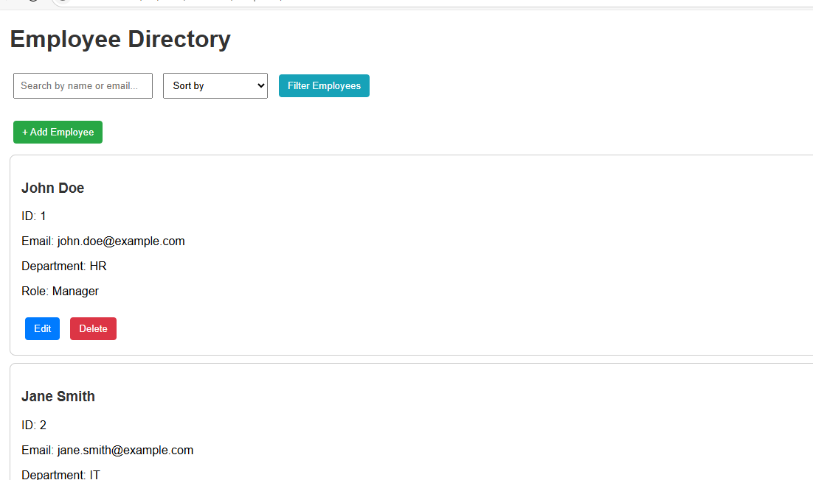
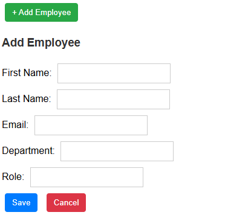
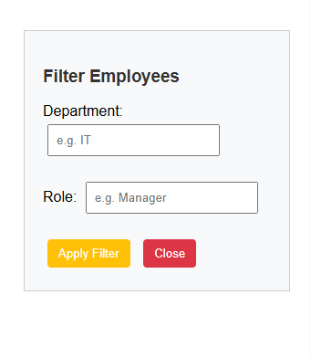

# Employee Directory Web Application

This is a responsive Employee Directory web interface built using **HTML**, **CSS**, **JavaScript**, and **Freemarker templates (simulated with .html here)**.  
It allows you to manage employees with features like Add, Edit, Delete, Search, Sort, Filter, and Pagination — all on the frontend with local data.

---

## 🚀 Features

- List employees with ID, Name, Email, Department, and Role.
- **Add / Edit Employee:** Inline form with validations.
- **Delete Employee:** With confirmation.
- **Search:** By first name, last name, or email.
- **Sort:** By first name or department.
- **Filter:** By department and role using a filter sidebar/popup.
- **Pagination:** Choose to view 10, 25, 50, or 100 employees per page.
- Fully **responsive design** for desktop, tablet, and mobile.

---

## 📂 Project Structure

employee-directory/
├── src/
│ └── main/
│ └── resources/
│ ├── templates/
│ │ └── dashboard.html # Main page rendered (simulated Freemarker)
│ └── static/
│ ├── css/
│ │ └── style.css # Stylesheet for layout, buttons, etc.
│ └── js/
│ ├── data.js # Mock employee data
│ └── app.js # Handles all interactivity
├── screenshots/
│ ├── dashboard.png
│ ├── add-employee.png
│ └── filter.png
└── README.md

---

## 📸 Screenshots

### 🔎 Dashboard

### ➕ Add/Edit Employee

### 🗂 Filter Sidebar

---

## 🛠 Setup & Run

> No backend required.  
> Just open `dashboard.html` in your browser.

### Or serve with Live Server
1. Open the project folder in VS Code.
2. Right click `dashboard.html` → `Open with Live Server`.

---

## 📝 Reflection

### 🚧 Challenges Faced
- Implementing combined filtering, search, and sorting with pagination while keeping performance smooth.
- Making the form dynamic for both add & edit with inline validations.

### 💡 Improvements (Future)
- Persist data with `localStorage` or an API.
- Add smooth animations for adding, filtering, or paginating items.
- More robust email/field validations.

---

## ✅ Submission Notes

- Fully meets assignment specs:
  - Uses vanilla JS for DOM manipulation & state.
  - Uses Freemarker-like `dashboard.html` as template.
  - All features (Add/Edit/Delete/Search/Sort/Filter/Pagination) implemented.
  - Completely responsive on mobile, tablet, and desktop.
- Pushed to [GitHub](https://github.com/Laharivanaja/employee-directory).

---

### 🥳 Thank you for reviewing!
